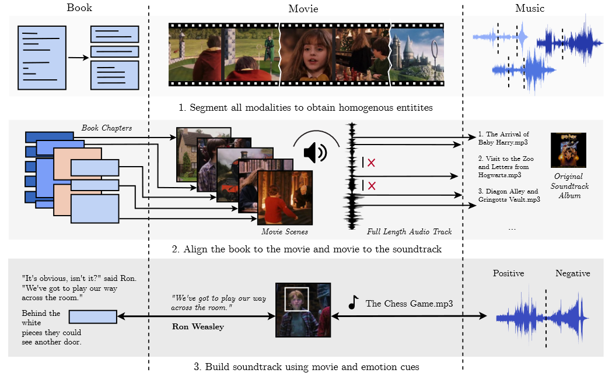

<h1 align="center">Sonus Texere! Automated Dense Soundtrack Construction for Books Using Movie Adaptations</h1>

Code for the paper "Sonus Texere! Automated Dense Soundtrack Construction for Books Using Movie Adaptations", ISMIR 2022 (Brave New Idea Award).



# Abstract

 Reading, much like music listening, is an immersive experience that transports readers while taking them on an emotional journey. Listening to complementary music has the potential to amplify the reading experience, especially when the music is stylistically cohesive and emotionally relevant. In this paper, we propose the first fully automatic method to build a dense soundtrack for books, which can play high-quality instrumental music for the entirety of the reading duration. Our work employs a unique text processing and music weaving pipeline that determines the context and emotional composition of scenes in a chapter. This allows our method to identify and play relevant excerpts from the soundtrack of the book's movie adaptation. By relying on the movie composer's craftsmanship, our book soundtracks include expert-made motifs and other scene-specific musical characteristics. We validate the design decisions of our approach through a perceptual study. Our readers note that the book soundtrack greatly enhanced their reading experience, due to high immersiveness granted via uninterrupted and style-consistent music, and a heightened emotional state attained via high precision emotion and scene context recognition. 

# Run the Code

This is the alpha version of the code. As a result, some dependencies may not be explicitly stated. Feel free to raise an issue if you have any questions. Detailed instructions to run the code can be found in the [Instructions](./INSTRUCTIONS.md) file.

# Citation

If you use this code, please cite the following paper:

```
@inproceedings{sonus2022,
  title={Sonus Texere! Automated Dense Soundtrack Construction for Books Using Movie Adaptations},
  author={Jaidev Shriram, Makarand Tapaswi, and Vinoo Alluri},
    booktitle={Proceedings of the 23rd International Society for Music Information Retrieval Conference},
    year={2022}
}